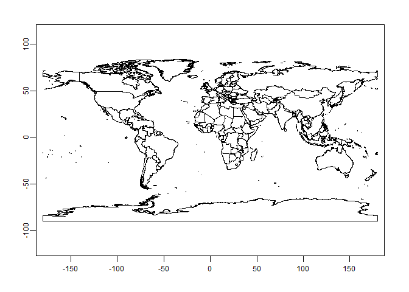
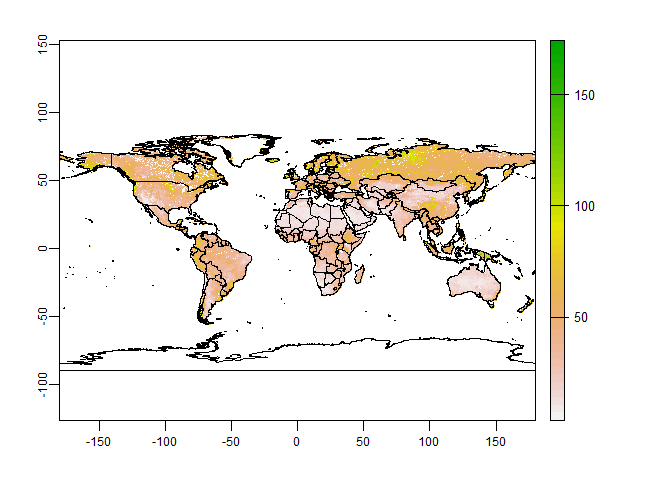
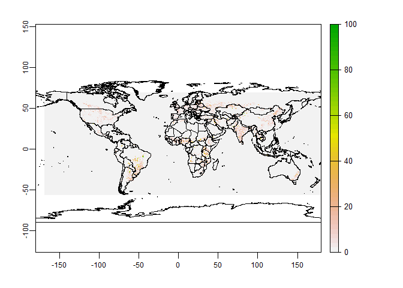

Global Cropland Expansion and Soils at Risk
================
Mandy Liesch

-   [Purpose](#purpose)
    -   [R Packages](#r-packages)
    -   [Raw Data and Preparations](#raw-data-and-preparations)
        -   [Countries](#countries)
        -   [Soil Grids: Total Soil Carbon Stocks 0-30
            cm](#soil-grids-total-soil-carbon-stocks-0-30-cm)
        -   [Cropland Extent Changes](#cropland-extent-changes)
    -   [Preliminary Analysis](#preliminary-analysis)
        -   [Tables by Region](#tables-by-region)
        -   [Bivariate Chloropleth Maps By
            Region](#bivariate-chloropleth-maps-by-region)
        -   [Dyanamic Country Results](#dyanamic-country-results)

# Purpose

The purpose of this vignette is looking at the land use changes around
the globe by different land use types using the R Terra Package,
masking, zonal statisitics, and visualizations with bivariate cholopleth
maps to visualize the cropland gains and losses by country/state.

A Note on file size:

`terraOptions(tempDir="F:/temp")`

## R Packages

``` r
library(biscale)
library(cowplot)
library(exactextractr)
library(gdalUtils)
library(geodata)
library(ggplot2)
library(ggridges)
library(rgdal)
library(sf)
library(terra)
library(tidyverse)

terraOptions(tempDir="F:/temp")
```

## Raw Data and Preparations

### Countries

``` r
w <- world(path=tempdir())

plot(w)
```

<!-- -->

``` r
w
```

    ##  class       : SpatVector 
    ##  geometry    : polygons 
    ##  dimensions  : 231, 2  (geometries, attributes)
    ##  extent      : -180, 180, -90, 83.65625  (xmin, xmax, ymin, ymax)
    ##  coord. ref. : +proj=longlat +datum=WGS84 +no_defs

### Soil Grids: Total Soil Carbon Stocks 0-30 cm

[SoilGrids](soilgrids.org) is a system for global digital soil mapping
that makes use of global soil profile information and covariate data to
model the spatial distribution of soil properties across the globe.
SoilGrids is a collections of soil property maps for the world produced
using machine learning at 250 m resolution. The [Soil Grids 2.0
FAQs](https://www.isric.org/explore/soilgrids/faq-soilgrids#How_can_I_access_SoilGrids)
details the file structure and downloads for both the soil grids data
for soil carbon, as well as the uncertainty.

This code process takes you through how to grab the WebDAV protocol
modelled off of the [SoilGrids
Notebook](https://git.wur.nl/isric/soilgrids/soilgrids.notebooks/-/blob/master/markdown/webdav_from_R.md),
using the GDAL functionality in R.

``` r
library(rgdal)
library(gdalUtils)

link="/vsicurl/https://files.isric.org/soilgrids/latest/data/ocs/ocs_0-30cm_Q0.5.vrt"

gdal_translate(link,
    "soilC_Rast.tif",
    co=c("TILED=YES","COMPRESS=DEFLATE","BIGTIFF=YES"),
    verbose=TRUE)
```

``` r
scStock<-rast("soilC_Rast.tif")

plot(scStock)

project(scStock, w, filename="Reproj_SoilC.tif")
```

``` r
scStock<-rast("Reproj_SoilC.tif")

plot(scStock)
plot(w, bg="transparent", add=TRUE)
```

<!-- -->

### Cropland Extent Changes

The dataset represents a globally consistent cropland extent time-series
at 30-m spatial resolution. Cropland defined as land used for annual and
perennial herbaceous crops for human consumption, forage (including
hay), and biofuel. It is on the [Global Land Analysis and
Discovery](https://glad.umd.edu/dataset/croplands), on a project through
the University of Maryland.

The chosen rasters downloaded are the Cropland Gain
(Global_cropland_3km_netgain.tif).

The net cropland extent change from 2003 to 2019 is shown as the Pixel
value: 0-100, percent of cropland dynamic (loss or gain) per pixel.

``` r
cropGain<-rast("Global_cropland_3km_netgain.tif")


project(cropGain, scStock, filename="Reproj_cropGain.tif")
```

``` r
gains<-rast("Reproj_cropGain.tif")

plot(gains)
plot(w, bg="transparent", add=TRUE)
```

<!-- -->

## Preliminary Analysis

``` r
shapeSF <- sf::st_as_sf(w)

regions<-read_csv("regions.csv")

shapes<-merge(shapeSF, regions, by="GID_0")

shapes$TotalCount<-exact_extract(scStock, shapes, 'count')
shapes$totC_Mean<-exact_extract(scStock, shapes, 'mean')
shapes$cropGains_Mean<-exact_extract(gains, shapes, 'mean')
```

### Tables by Region

``` r
summary<-na.omit(shapes) 
summary$geometry<-NULL


sumStats <- summary %>%
  group_by(Region) %>%
  summarise_at(vars(totC_Mean, cropGains_Mean), list(name = mean))

ggplot(summary, aes(x = cropGains_Mean, y = Region)) +
  geom_density_ridges(scale = 4) + 
  scale_y_discrete(expand = c(0, 0)) +     # will generally have to set the `expand` option
  scale_x_continuous(expand = c(0, 0)) +   # for both axes to remove unneeded padding
  coord_cartesian(clip = "off") + # to avoid clipping of the very top of the top ridgeline
  theme_ridges()


ggplot(summary, aes(x = totC_Mean, y = Region)) +
  geom_density_ridges(scale = 4) + 
  scale_y_discrete(expand = c(0, 0)) +     # will generally have to set the `expand` option
  scale_x_continuous(expand = c(0, 0)) +   # for both axes to remove unneeded padding
  coord_cartesian(clip = "off") + # to avoid clipping of the very top of the top ridgeline
  theme_ridges()
```

### Bivariate Chloropleth Maps By Region

``` r
shapes<-na.omit(shapes) 

shapes <- bi_class(shapes, x = cropGains_Mean, y = totC_Mean, style = "jenks", dim = 3)

map <- ggplot() +
  geom_sf(data = shapes, mapping = aes(fill = bi_class), color = "white", size = 0.1, show.legend = FALSE) +
  bi_scale_fill(pal = "DkBlue", dim = 3) +
  labs(
    title = "Cropland Gains and 30 cm Carbon Stocks",
  ) +
  bi_theme()

legend <- bi_legend(pal = "DkBlue",
                    dim = 3,
                    xlab = "Cropland Gain",
                    ylab = "Carbon Stocks",
                    size = 12)

finalPlot <- ggdraw() +
  draw_plot(map, 0, 0, 1, 1) +
  draw_plot(legend, 0, 0.2, 0.2, 0.2)
```

### Dyanamic Country Results

``` r
newShape<-shapes
newShape$geometry<-NULL

highRisk<-newShape %>%
  filter(bi_class == '3-3'|bi_class == '3-2') %>%
  select(NAME_0, bi_class, Continent, totC_Mean, cropGains_Mean)

highRisk
```
