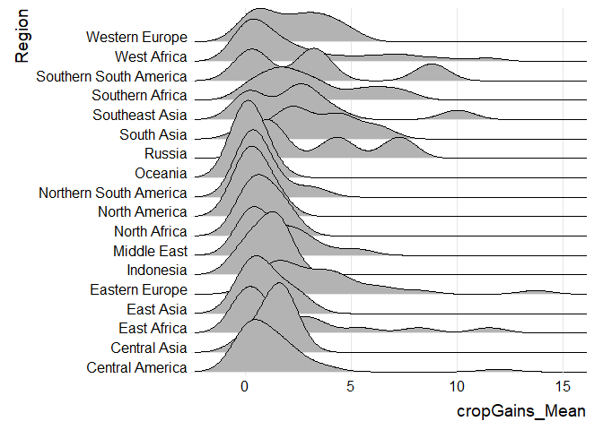
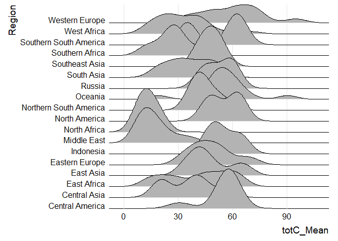
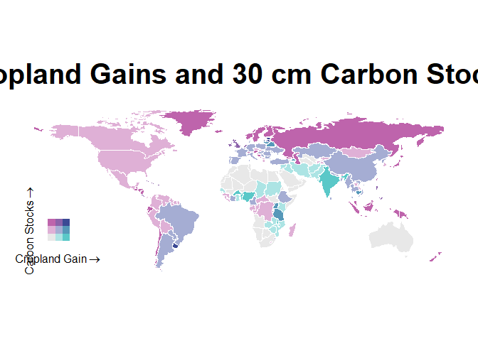
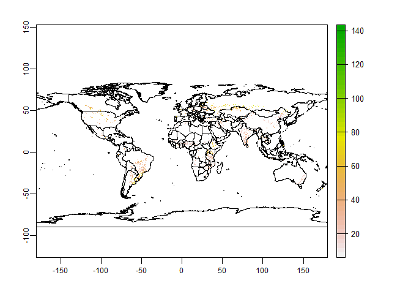
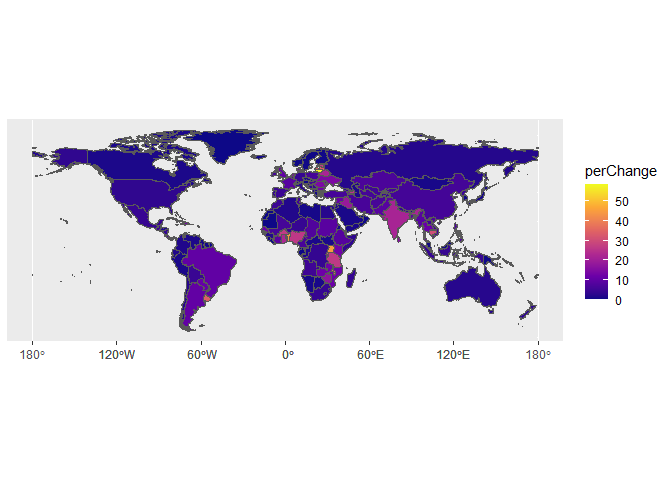

Global Cropland Expansion and Soils at Risk
================
Mandy Liesch

-   [Purpose](#purpose)
-   [R Packages](#r-packages)
-   [Raw Data and Preparations](#raw-data-and-preparations)
    -   [Countries](#countries)
    -   [Soil Grids: Total Soil Carbon Stocks 0-30
        cm](#soil-grids-total-soil-carbon-stocks-0-30-cm)
    -   [Cropland Extent Changes](#cropland-extent-changes)
-   [Preliminary Analysis](#preliminary-analysis)
    -   [Tables by Region](#tables-by-region)
    -   [Ridgeplots of Regional Data](#ridgeplots-of-regional-data)
    -   [Bivariate Chloropleth Maps By
        Region](#bivariate-chloropleth-maps-by-region)
    -   [Dyanamic Country Results](#dyanamic-country-results)
-   [Detailed Analysis](#detailed-analysis)

# Purpose

The purpose of this vignette is looking at the land use changes around
the globe by different land use types using the R Terra Package,
masking, zonal statisitics, and visualizations with bivariate cholopleth
maps to visualize the cropland gains and losses by country/state.

A Note on file size:

`terraOptions(tempDir="F:/temp")`

# R Packages

``` r
library(biscale)
library(cowplot)
library(exactextractr)
library(gdalUtils)
library(geodata)
library(ggplot2)
library(ggridges)
library(rgdal)
library(rmarkdown)
library(sf)
library(terra)
library(tidyverse)

terraOptions(tempDir="F:/temp")
```

# Raw Data and Preparations

## Countries

``` r
w <- world(path=tempdir())

plot(w)
```

<!-- -->

``` r
w
```

    ##  class       : SpatVector 
    ##  geometry    : polygons 
    ##  dimensions  : 231, 2  (geometries, attributes)
    ##  extent      : -180, 180, -90, 83.65625  (xmin, xmax, ymin, ymax)
    ##  coord. ref. : +proj=longlat +datum=WGS84 +no_defs 
    ##  names       : GID_0      NAME_0
    ##  type        : <chr>       <chr>
    ##  values      :   ABW       Aruba
    ##                  AFG Afghanistan
    ##                  AGO      Angola

## Soil Grids: Total Soil Carbon Stocks 0-30 cm

[SoilGrids](soilgrids.org) is a system for global digital soil mapping
that makes use of global soil profile information and covariate data to
model the spatial distribution of soil properties across the globe.
SoilGrids is a collections of soil property maps for the world produced
using machine learning at 250 m resolution. The [Soil Grids 2.0
FAQs](https://www.isric.org/explore/soilgrids/faq-soilgrids#How_can_I_access_SoilGrids)
details the file structure and downloads for both the soil grids data
for soil carbon, as well as the uncertainty.

This code process takes you through how to grab the WebDAV protocol
modelled off of the [SoilGrids
Notebook](https://git.wur.nl/isric/soilgrids/soilgrids.notebooks/-/blob/master/markdown/webdav_from_R.md),
using the GDAL functionality in R.

``` r
library(rgdal)
library(gdalUtils)

link="/vsicurl/https://files.isric.org/soilgrids/latest/data/ocs/ocs_0-30cm_Q0.5.vrt"

gdal_translate(link,
    "soilC_Rast.tif",
    co=c("TILED=YES","COMPRESS=DEFLATE","BIGTIFF=YES"),
    verbose=TRUE)
```

``` r
scStock<-rast("soilC_Rast.tif")

plot(scStock)

project(scStock, w, filename="Reproj_SoilC.tif")
```

``` r
scStock<-rast("Reproj_SoilC.tif")

plot(scStock)
plot(w, bg="transparent", add=TRUE)
```

<!-- -->

## Cropland Extent Changes

The dataset represents a globally consistent cropland extent time-series
at 30-m spatial resolution. Cropland defined as land used for annual and
perennial herbaceous crops for human consumption, forage (including
hay), and biofuel. It is on the [Global Land Analysis and
Discovery](https://glad.umd.edu/dataset/croplands), on a project through
the University of Maryland.

The chosen rasters downloaded are the Cropland Gain
(Global_cropland_3km_netgain.tif).

The net cropland extent change from 2003 to 2019 is shown as the Pixel
value: 0-100, percent of cropland dynamic (loss or gain) per pixel.

``` r
cropGain<-rast("Global_cropland_3km_netgain.tif")


project(cropGain, scStock, filename="Reproj_cropGain.tif")
```

``` r
gains<-rast("Reproj_cropGain.tif")

plot(gains)
plot(w, bg="transparent", add=TRUE)
```

<!-- -->

# Preliminary Analysis

``` r
shapeSF <- sf::st_as_sf(w)

regions<-read_csv("regions.csv")

shapes<-merge(shapeSF, regions, by="GID_0")

shapes$TotalCount<-exact_extract(scStock, shapes, 'count')
```

    ##   |                                                                                                         |                                                                                                 |   0%  |                                                                                                         |=                                                                                                |   1%  |                                                                                                         |==                                                                                               |   2%  |                                                                                                         |===                                                                                              |   3%  |                                                                                                         |====                                                                                             |   4%  |                                                                                                         |=====                                                                                            |   5%  |                                                                                                         |=====                                                                                            |   6%  |                                                                                                         |======                                                                                           |   6%  |                                                                                                         |=======                                                                                          |   7%  |                                                                                                         |========                                                                                         |   8%  |                                                                                                         |========                                                                                         |   9%  |                                                                                                         |=========                                                                                        |   9%  |                                                                                                         |=========                                                                                        |  10%  |                                                                                                         |==========                                                                                       |  10%  |                                                                                                         |==========                                                                                       |  11%  |                                                                                                         |===========                                                                                      |  11%  |                                                                                                         |===========                                                                                      |  12%  |                                                                                                         |============                                                                                     |  12%  |                                                                                                         |============                                                                                     |  13%  |                                                                                                         |=============                                                                                    |  13%  |                                                                                                         |=============                                                                                    |  14%  |                                                                                                         |==============                                                                                   |  14%  |                                                                                                         |==============                                                                                   |  15%  |                                                                                                         |===============                                                                                  |  15%  |                                                                                                         |===============                                                                                  |  16%  |                                                                                                         |================                                                                                 |  16%  |                                                                                                         |================                                                                                 |  17%  |                                                                                                         |=================                                                                                |  17%  |                                                                                                         |=================                                                                                |  18%  |                                                                                                         |==================                                                                               |  18%  |                                                                                                         |==================                                                                               |  19%  |                                                                                                         |===================                                                                              |  19%  |                                                                                                         |===================                                                                              |  20%  |                                                                                                         |====================                                                                             |  20%  |                                                                                                         |====================                                                                             |  21%  |                                                                                                         |=====================                                                                            |  21%  |                                                                                                         |=====================                                                                            |  22%  |                                                                                                         |======================                                                                           |  23%  |                                                                                                         |=======================                                                                          |  23%  |                                                                                                         |=======================                                                                          |  24%  |                                                                                                         |========================                                                                         |  24%  |                                                                                                         |========================                                                                         |  25%  |                                                                                                         |=========================                                                                        |  26%  |                                                                                                         |==========================                                                                       |  26%  |                                                                                                         |==========================                                                                       |  27%  |                                                                                                         |===========================                                                                      |  28%  |                                                                                                         |============================                                                                     |  29%  |                                                                                                         |=============================                                                                    |  29%  |                                                                                                         |=============================                                                                    |  30%  |                                                                                                         |==============================                                                                   |  31%  |                                                                                                         |===============================                                                                  |  32%  |                                                                                                         |================================                                                                 |  33%  |                                                                                                         |=================================                                                                |  34%  |                                                                                                         |==================================                                                               |  35%  |                                                                                                         |===================================                                                              |  36%  |                                                                                                         |====================================                                                             |  37%  |                                                                                                         |=====================================                                                            |  38%  |                                                                                                         |=====================================                                                            |  39%  |                                                                                                         |======================================                                                           |  39%  |                                                                                                         |=======================================                                                          |  40%  |                                                                                                         |=======================================                                                          |  41%  |                                                                                                         |========================================                                                         |  41%  |                                                                                                         |========================================                                                         |  42%  |                                                                                                         |=========================================                                                        |  42%  |                                                                                                         |==========================================                                                       |  43%  |                                                                                                         |==========================================                                                       |  44%  |                                                                                                         |===========================================                                                      |  44%  |                                                                                                         |===========================================                                                      |  45%  |                                                                                                         |============================================                                                     |  45%  |                                                                                                         |=============================================                                                    |  46%  |                                                                                                         |=============================================                                                    |  47%  |                                                                                                         |==============================================                                                   |  47%  |                                                                                                         |==============================================                                                   |  48%  |                                                                                                         |===============================================                                                  |  48%  |                                                                                                         |===============================================                                                  |  49%  |                                                                                                         |================================================                                                 |  49%  |                                                                                                         |================================================                                                 |  50%  |                                                                                                         |=================================================                                                |  50%  |                                                                                                         |=================================================                                                |  51%  |                                                                                                         |==================================================                                               |  51%  |                                                                                                         |==================================================                                               |  52%  |                                                                                                         |===================================================                                              |  52%  |                                                                                                         |===================================================                                              |  53%  |                                                                                                         |====================================================                                             |  53%  |                                                                                                         |====================================================                                             |  54%  |                                                                                                         |=====================================================                                            |  55%  |                                                                                                         |======================================================                                           |  55%  |                                                                                                         |======================================================                                           |  56%  |                                                                                                         |=======================================================                                          |  56%  |                                                                                                         |=======================================================                                          |  57%  |                                                                                                         |========================================================                                         |  58%  |                                                                                                         |=========================================================                                        |  58%  |                                                                                                         |=========================================================                                        |  59%  |                                                                                                         |==========================================================                                       |  59%  |                                                                                                         |==========================================================                                       |  60%  |                                                                                                         |===========================================================                                      |  61%  |                                                                                                         |============================================================                                     |  61%  |                                                                                                         |============================================================                                     |  62%  |                                                                                                         |=============================================================                                    |  63%  |                                                                                                         |==============================================================                                   |  64%  |                                                                                                         |===============================================================                                  |  65%  |                                                                                                         |================================================================                                 |  66%  |                                                                                                         |=================================================================                                |  67%  |                                                                                                         |==================================================================                               |  68%  |                                                                                                         |===================================================================                              |  69%  |                                                                                                         |====================================================================                             |  70%  |                                                                                                         |====================================================================                             |  71%  |                                                                                                         |=====================================================================                            |  71%  |                                                                                                         |======================================================================                           |  72%  |                                                                                                         |=======================================================================                          |  73%  |                                                                                                         |=======================================================================                          |  74%  |                                                                                                         |========================================================================                         |  74%  |                                                                                                         |=========================================================================                        |  75%  |                                                                                                         |=========================================================================                        |  76%  |                                                                                                         |==========================================================================                       |  76%  |                                                                                                         |==========================================================================                       |  77%  |                                                                                                         |===========================================================================                      |  77%  |                                                                                                         |============================================================================                     |  78%  |                                                                                                         |============================================================================                     |  79%  |                                                                                                         |=============================================================================                    |  79%  |                                                                                                         |=============================================================================                    |  80%  |                                                                                                         |==============================================================================                   |  80%  |                                                                                                         |==============================================================================                   |  81%  |                                                                                                         |===============================================================================                  |  81%  |                                                                                                         |===============================================================================                  |  82%  |                                                                                                         |================================================================================                 |  82%  |                                                                                                         |================================================================================                 |  83%  |                                                                                                         |=================================================================================                |  83%  |                                                                                                         |=================================================================================                |  84%  |                                                                                                         |==================================================================================               |  84%  |                                                                                                         |==================================================================================               |  85%  |                                                                                                         |===================================================================================              |  85%  |                                                                                                         |===================================================================================              |  86%  |                                                                                                         |====================================================================================             |  86%  |                                                                                                         |====================================================================================             |  87%  |                                                                                                         |=====================================================================================            |  87%  |                                                                                                         |=====================================================================================            |  88%  |                                                                                                         |======================================================================================           |  88%  |                                                                                                         |======================================================================================           |  89%  |                                                                                                         |=======================================================================================          |  89%  |                                                                                                         |=======================================================================================          |  90%  |                                                                                                         |========================================================================================         |  90%  |                                                                                                         |========================================================================================         |  91%  |                                                                                                         |=========================================================================================        |  91%  |                                                                                                         |=========================================================================================        |  92%  |                                                                                                         |==========================================================================================       |  93%  |                                                                                                         |===========================================================================================      |  94%  |                                                                                                         |============================================================================================     |  94%  |                                                                                                         |============================================================================================     |  95%  |                                                                                                         |=============================================================================================    |  96%  |                                                                                                         |==============================================================================================   |  97%  |                                                                                                         |===============================================================================================  |  98%  |                                                                                                         |================================================================================================ |  99%  |                                                                                                         |=================================================================================================| 100%

``` r
shapes$totC_Mean<-exact_extract(scStock, shapes, 'mean')
```

    ##   |                                                                                                         |                                                                                                 |   0%  |                                                                                                         |=                                                                                                |   1%  |                                                                                                         |==                                                                                               |   2%  |                                                                                                         |===                                                                                              |   3%  |                                                                                                         |====                                                                                             |   4%  |                                                                                                         |=====                                                                                            |   5%  |                                                                                                         |=====                                                                                            |   6%  |                                                                                                         |======                                                                                           |   6%  |                                                                                                         |=======                                                                                          |   7%  |                                                                                                         |========                                                                                         |   8%  |                                                                                                         |========                                                                                         |   9%  |                                                                                                         |=========                                                                                        |   9%  |                                                                                                         |=========                                                                                        |  10%  |                                                                                                         |==========                                                                                       |  10%  |                                                                                                         |==========                                                                                       |  11%  |                                                                                                         |===========                                                                                      |  11%  |                                                                                                         |===========                                                                                      |  12%  |                                                                                                         |============                                                                                     |  12%  |                                                                                                         |============                                                                                     |  13%  |                                                                                                         |=============                                                                                    |  13%  |                                                                                                         |=============                                                                                    |  14%  |                                                                                                         |==============                                                                                   |  14%  |                                                                                                         |==============                                                                                   |  15%  |                                                                                                         |===============                                                                                  |  15%  |                                                                                                         |===============                                                                                  |  16%  |                                                                                                         |================                                                                                 |  16%  |                                                                                                         |================                                                                                 |  17%  |                                                                                                         |=================                                                                                |  17%  |                                                                                                         |=================                                                                                |  18%  |                                                                                                         |==================                                                                               |  18%  |                                                                                                         |==================                                                                               |  19%  |                                                                                                         |===================                                                                              |  19%  |                                                                                                         |===================                                                                              |  20%  |                                                                                                         |====================                                                                             |  20%  |                                                                                                         |====================                                                                             |  21%  |                                                                                                         |=====================                                                                            |  21%  |                                                                                                         |=====================                                                                            |  22%  |                                                                                                         |======================                                                                           |  23%  |                                                                                                         |=======================                                                                          |  23%  |                                                                                                         |=======================                                                                          |  24%  |                                                                                                         |========================                                                                         |  24%  |                                                                                                         |========================                                                                         |  25%  |                                                                                                         |=========================                                                                        |  26%  |                                                                                                         |==========================                                                                       |  26%  |                                                                                                         |==========================                                                                       |  27%  |                                                                                                         |===========================                                                                      |  28%  |                                                                                                         |============================                                                                     |  29%  |                                                                                                         |=============================                                                                    |  29%  |                                                                                                         |=============================                                                                    |  30%  |                                                                                                         |==============================                                                                   |  31%  |                                                                                                         |===============================                                                                  |  32%  |                                                                                                         |================================                                                                 |  33%  |                                                                                                         |=================================                                                                |  34%  |                                                                                                         |==================================                                                               |  35%  |                                                                                                         |===================================                                                              |  36%  |                                                                                                         |====================================                                                             |  37%  |                                                                                                         |=====================================                                                            |  38%  |                                                                                                         |=====================================                                                            |  39%  |                                                                                                         |======================================                                                           |  39%  |                                                                                                         |=======================================                                                          |  40%  |                                                                                                         |=======================================                                                          |  41%  |                                                                                                         |========================================                                                         |  41%  |                                                                                                         |========================================                                                         |  42%  |                                                                                                         |=========================================                                                        |  42%  |                                                                                                         |==========================================                                                       |  43%  |                                                                                                         |==========================================                                                       |  44%  |                                                                                                         |===========================================                                                      |  44%  |                                                                                                         |===========================================                                                      |  45%  |                                                                                                         |============================================                                                     |  45%  |                                                                                                         |=============================================                                                    |  46%  |                                                                                                         |=============================================                                                    |  47%  |                                                                                                         |==============================================                                                   |  47%  |                                                                                                         |==============================================                                                   |  48%  |                                                                                                         |===============================================                                                  |  48%  |                                                                                                         |===============================================                                                  |  49%  |                                                                                                         |================================================                                                 |  49%  |                                                                                                         |================================================                                                 |  50%  |                                                                                                         |=================================================                                                |  50%  |                                                                                                         |=================================================                                                |  51%  |                                                                                                         |==================================================                                               |  51%  |                                                                                                         |==================================================                                               |  52%  |                                                                                                         |===================================================                                              |  52%  |                                                                                                         |===================================================                                              |  53%  |                                                                                                         |====================================================                                             |  53%  |                                                                                                         |====================================================                                             |  54%  |                                                                                                         |=====================================================                                            |  55%  |                                                                                                         |======================================================                                           |  55%  |                                                                                                         |======================================================                                           |  56%  |                                                                                                         |=======================================================                                          |  56%  |                                                                                                         |=======================================================                                          |  57%  |                                                                                                         |========================================================                                         |  58%  |                                                                                                         |=========================================================                                        |  58%  |                                                                                                         |=========================================================                                        |  59%  |                                                                                                         |==========================================================                                       |  59%  |                                                                                                         |==========================================================                                       |  60%  |                                                                                                         |===========================================================                                      |  61%  |                                                                                                         |============================================================                                     |  61%  |                                                                                                         |============================================================                                     |  62%  |                                                                                                         |=============================================================                                    |  63%  |                                                                                                         |==============================================================                                   |  64%  |                                                                                                         |===============================================================                                  |  65%  |                                                                                                         |================================================================                                 |  66%  |                                                                                                         |=================================================================                                |  67%  |                                                                                                         |==================================================================                               |  68%  |                                                                                                         |===================================================================                              |  69%  |                                                                                                         |====================================================================                             |  70%  |                                                                                                         |====================================================================                             |  71%  |                                                                                                         |=====================================================================                            |  71%  |                                                                                                         |======================================================================                           |  72%  |                                                                                                         |=======================================================================                          |  73%  |                                                                                                         |=======================================================================                          |  74%  |                                                                                                         |========================================================================                         |  74%  |                                                                                                         |=========================================================================                        |  75%  |                                                                                                         |=========================================================================                        |  76%  |                                                                                                         |==========================================================================                       |  76%  |                                                                                                         |==========================================================================                       |  77%  |                                                                                                         |===========================================================================                      |  77%  |                                                                                                         |============================================================================                     |  78%  |                                                                                                         |============================================================================                     |  79%  |                                                                                                         |=============================================================================                    |  79%  |                                                                                                         |=============================================================================                    |  80%  |                                                                                                         |==============================================================================                   |  80%  |                                                                                                         |==============================================================================                   |  81%  |                                                                                                         |===============================================================================                  |  81%  |                                                                                                         |===============================================================================                  |  82%  |                                                                                                         |================================================================================                 |  82%  |                                                                                                         |================================================================================                 |  83%  |                                                                                                         |=================================================================================                |  83%  |                                                                                                         |=================================================================================                |  84%  |                                                                                                         |==================================================================================               |  84%  |                                                                                                         |==================================================================================               |  85%  |                                                                                                         |===================================================================================              |  85%  |                                                                                                         |===================================================================================              |  86%  |                                                                                                         |====================================================================================             |  86%  |                                                                                                         |====================================================================================             |  87%  |                                                                                                         |=====================================================================================            |  87%  |                                                                                                         |=====================================================================================            |  88%  |                                                                                                         |======================================================================================           |  88%  |                                                                                                         |======================================================================================           |  89%  |                                                                                                         |=======================================================================================          |  89%  |                                                                                                         |=======================================================================================          |  90%  |                                                                                                         |========================================================================================         |  90%  |                                                                                                         |========================================================================================         |  91%  |                                                                                                         |=========================================================================================        |  91%  |                                                                                                         |=========================================================================================        |  92%  |                                                                                                         |==========================================================================================       |  93%  |                                                                                                         |===========================================================================================      |  94%  |                                                                                                         |============================================================================================     |  94%  |                                                                                                         |============================================================================================     |  95%  |                                                                                                         |=============================================================================================    |  96%  |                                                                                                         |==============================================================================================   |  97%  |                                                                                                         |===============================================================================================  |  98%  |                                                                                                         |================================================================================================ |  99%  |                                                                                                         |=================================================================================================| 100%

``` r
shapes$cropGains_Mean<-exact_extract(gains, shapes, 'mean')
```

    ##   |                                                                                                         |                                                                                                 |   0%  |                                                                                                         |=                                                                                                |   1%  |                                                                                                         |==                                                                                               |   2%  |                                                                                                         |===                                                                                              |   3%  |                                                                                                         |====                                                                                             |   4%  |                                                                                                         |=====                                                                                            |   5%  |                                                                                                         |=====                                                                                            |   6%  |                                                                                                         |======                                                                                           |   6%  |                                                                                                         |=======                                                                                          |   7%  |                                                                                                         |========                                                                                         |   8%  |                                                                                                         |========                                                                                         |   9%  |                                                                                                         |=========                                                                                        |   9%  |                                                                                                         |=========                                                                                        |  10%  |                                                                                                         |==========                                                                                       |  10%  |                                                                                                         |==========                                                                                       |  11%  |                                                                                                         |===========                                                                                      |  11%  |                                                                                                         |===========                                                                                      |  12%  |                                                                                                         |============                                                                                     |  12%  |                                                                                                         |============                                                                                     |  13%  |                                                                                                         |=============                                                                                    |  13%  |                                                                                                         |=============                                                                                    |  14%  |                                                                                                         |==============                                                                                   |  14%  |                                                                                                         |==============                                                                                   |  15%  |                                                                                                         |===============                                                                                  |  15%  |                                                                                                         |===============                                                                                  |  16%  |                                                                                                         |================                                                                                 |  16%  |                                                                                                         |================                                                                                 |  17%  |                                                                                                         |=================                                                                                |  17%  |                                                                                                         |=================                                                                                |  18%  |                                                                                                         |==================                                                                               |  18%  |                                                                                                         |==================                                                                               |  19%  |                                                                                                         |===================                                                                              |  19%  |                                                                                                         |===================                                                                              |  20%  |                                                                                                         |====================                                                                             |  20%  |                                                                                                         |====================                                                                             |  21%  |                                                                                                         |=====================                                                                            |  21%  |                                                                                                         |=====================                                                                            |  22%  |                                                                                                         |======================                                                                           |  23%  |                                                                                                         |=======================                                                                          |  23%  |                                                                                                         |=======================                                                                          |  24%  |                                                                                                         |========================                                                                         |  24%  |                                                                                                         |========================                                                                         |  25%  |                                                                                                         |=========================                                                                        |  26%  |                                                                                                         |==========================                                                                       |  26%  |                                                                                                         |==========================                                                                       |  27%  |                                                                                                         |===========================                                                                      |  28%  |                                                                                                         |============================                                                                     |  29%  |                                                                                                         |=============================                                                                    |  29%  |                                                                                                         |=============================                                                                    |  30%  |                                                                                                         |==============================                                                                   |  31%  |                                                                                                         |===============================                                                                  |  32%  |                                                                                                         |================================                                                                 |  33%  |                                                                                                         |=================================                                                                |  34%  |                                                                                                         |==================================                                                               |  35%  |                                                                                                         |===================================                                                              |  36%  |                                                                                                         |====================================                                                             |  37%  |                                                                                                         |=====================================                                                            |  38%  |                                                                                                         |=====================================                                                            |  39%  |                                                                                                         |======================================                                                           |  39%  |                                                                                                         |=======================================                                                          |  40%  |                                                                                                         |=======================================                                                          |  41%  |                                                                                                         |========================================                                                         |  41%  |                                                                                                         |========================================                                                         |  42%  |                                                                                                         |=========================================                                                        |  42%  |                                                                                                         |==========================================                                                       |  43%  |                                                                                                         |==========================================                                                       |  44%  |                                                                                                         |===========================================                                                      |  44%  |                                                                                                         |===========================================                                                      |  45%  |                                                                                                         |============================================                                                     |  45%  |                                                                                                         |=============================================                                                    |  46%  |                                                                                                         |=============================================                                                    |  47%  |                                                                                                         |==============================================                                                   |  47%  |                                                                                                         |==============================================                                                   |  48%  |                                                                                                         |===============================================                                                  |  48%  |                                                                                                         |===============================================                                                  |  49%  |                                                                                                         |================================================                                                 |  49%  |                                                                                                         |================================================                                                 |  50%  |                                                                                                         |=================================================                                                |  50%  |                                                                                                         |=================================================                                                |  51%  |                                                                                                         |==================================================                                               |  51%  |                                                                                                         |==================================================                                               |  52%  |                                                                                                         |===================================================                                              |  52%  |                                                                                                         |===================================================                                              |  53%  |                                                                                                         |====================================================                                             |  53%  |                                                                                                         |====================================================                                             |  54%  |                                                                                                         |=====================================================                                            |  55%  |                                                                                                         |======================================================                                           |  55%  |                                                                                                         |======================================================                                           |  56%  |                                                                                                         |=======================================================                                          |  56%  |                                                                                                         |=======================================================                                          |  57%  |                                                                                                         |========================================================                                         |  58%  |                                                                                                         |=========================================================                                        |  58%  |                                                                                                         |=========================================================                                        |  59%  |                                                                                                         |==========================================================                                       |  59%  |                                                                                                         |==========================================================                                       |  60%  |                                                                                                         |===========================================================                                      |  61%  |                                                                                                         |============================================================                                     |  61%  |                                                                                                         |============================================================                                     |  62%  |                                                                                                         |=============================================================                                    |  63%  |                                                                                                         |==============================================================                                   |  64%  |                                                                                                         |===============================================================                                  |  65%  |                                                                                                         |================================================================                                 |  66%  |                                                                                                         |=================================================================                                |  67%  |                                                                                                         |==================================================================                               |  68%  |                                                                                                         |===================================================================                              |  69%  |                                                                                                         |====================================================================                             |  70%  |                                                                                                         |====================================================================                             |  71%  |                                                                                                         |=====================================================================                            |  71%  |                                                                                                         |======================================================================                           |  72%  |                                                                                                         |=======================================================================                          |  73%  |                                                                                                         |=======================================================================                          |  74%  |                                                                                                         |========================================================================                         |  74%  |                                                                                                         |=========================================================================                        |  75%  |                                                                                                         |=========================================================================                        |  76%  |                                                                                                         |==========================================================================                       |  76%  |                                                                                                         |==========================================================================                       |  77%  |                                                                                                         |===========================================================================                      |  77%  |                                                                                                         |============================================================================                     |  78%  |                                                                                                         |============================================================================                     |  79%  |                                                                                                         |=============================================================================                    |  79%  |                                                                                                         |=============================================================================                    |  80%  |                                                                                                         |==============================================================================                   |  80%  |                                                                                                         |==============================================================================                   |  81%  |                                                                                                         |===============================================================================                  |  81%  |                                                                                                         |===============================================================================                  |  82%  |                                                                                                         |================================================================================                 |  82%  |                                                                                                         |================================================================================                 |  83%  |                                                                                                         |=================================================================================                |  83%  |                                                                                                         |=================================================================================                |  84%  |                                                                                                         |==================================================================================               |  84%  |                                                                                                         |==================================================================================               |  85%  |                                                                                                         |===================================================================================              |  85%  |                                                                                                         |===================================================================================              |  86%  |                                                                                                         |====================================================================================             |  86%  |                                                                                                         |====================================================================================             |  87%  |                                                                                                         |=====================================================================================            |  87%  |                                                                                                         |=====================================================================================            |  88%  |                                                                                                         |======================================================================================           |  88%  |                                                                                                         |======================================================================================           |  89%  |                                                                                                         |=======================================================================================          |  89%  |                                                                                                         |=======================================================================================          |  90%  |                                                                                                         |========================================================================================         |  90%  |                                                                                                         |========================================================================================         |  91%  |                                                                                                         |=========================================================================================        |  91%  |                                                                                                         |=========================================================================================        |  92%  |                                                                                                         |==========================================================================================       |  93%  |                                                                                                         |===========================================================================================      |  94%  |                                                                                                         |============================================================================================     |  94%  |                                                                                                         |============================================================================================     |  95%  |                                                                                                         |=============================================================================================    |  96%  |                                                                                                         |==============================================================================================   |  97%  |                                                                                                         |===============================================================================================  |  98%  |                                                                                                         |================================================================================================ |  99%  |                                                                                                         |=================================================================================================| 100%

## Tables by Region

``` r
summary<-na.omit(shapes) 
summary$geometry<-NULL


sumStats <- summary %>%
  group_by(Region) %>%
  summarise_at(vars(totC_Mean, cropGains_Mean), list(name = mean))
```

``` r
sumStats
```

    ## # A tibble: 18 x 3
    ##    Region                 totC_Mean_name cropGains_Mean_name
    ##    <chr>                           <dbl>               <dbl>
    ##  1 Central America                  54.5               1.32 
    ##  2 Central Asia                     36.2               1.37 
    ##  3 East Africa                      41.1               2.32 
    ##  4 East Asia                        47.3               0.920
    ##  5 Eastern Europe                   48.3               3.54 
    ##  6 Indonesia                        54.8               0.979
    ##  7 Middle East                      16.9               1.46 
    ##  8 North Africa                     13.4               0.816
    ##  9 North America                    55.5               0.423
    ## 10 Northern South America           44.6               0.744
    ## 11 Oceania                          55.5               0.184
    ## 12 Russia                           52.7               3.39 
    ## 13 South Asia                       36.4               3.15 
    ## 14 Southeast Asia                   47.6               2.73 
    ## 15 Southern Africa                  28.1               3.04 
    ## 16 Southern South America           51.5               3.17 
    ## 17 West Africa                      32.1               2.53 
    ## 18 Western Europe                   60.0               2.18

## Ridgeplots of Regional Data

``` r
cropGainPlot<-ggplot(summary, aes(x = cropGains_Mean, y = Region)) +
  geom_density_ridges(scale = 4) + 
  scale_y_discrete(expand = c(0, 0)) +     # will generally have to set the `expand` option
  scale_x_continuous(expand = c(0, 0)) +   # for both axes to remove unneeded padding
  coord_cartesian(clip = "off") + # to avoid clipping of the very top of the top ridgeline
  theme_ridges()


cropGainPlot
```

<!-- -->

``` r
SOCPlot<-ggplot(summary, aes(x = totC_Mean, y = Region)) +
  geom_density_ridges(scale = 4) + 
  scale_y_discrete(expand = c(0, 0)) +     # will generally have to set the `expand` option
  scale_x_continuous(expand = c(0, 0)) +   # for both axes to remove unneeded padding
  coord_cartesian(clip = "off") + # to avoid clipping of the very top of the top ridgeline
  theme_ridges()

SOCPlot
```

<!-- -->

## Bivariate Chloropleth Maps By Region

``` r
shapes<-na.omit(shapes) 

shapes <- bi_class(shapes, x = cropGains_Mean, y = totC_Mean, style = "jenks", dim = 3)

map <- ggplot() +
  geom_sf(data = shapes, mapping = aes(fill = bi_class), color = "white", size = 0.1, show.legend = FALSE) +
  bi_scale_fill(pal = "DkBlue", dim = 3) +
  labs(
    title = "Cropland Gains and 30 cm Carbon Stocks",
  ) +
  bi_theme()

legend <- bi_legend(pal = "DkBlue",
                    dim = 3,
                    xlab = "Cropland Gain",
                    ylab = "Carbon Stocks",
                    size = 12)

finalPlot <- ggdraw() +
  draw_plot(map, 0, 0, 1, 1) +
  draw_plot(legend, 0, 0.2, 0.2, 0.2)


finalPlot
```

<!-- -->

## Dyanamic Country Results

``` r
newShape<-shapes
newShape$geometry<-NULL

highRisk<-newShape %>%
  filter(bi_class == '3-3'|bi_class == '3-2') %>%
  select(NAME_0, bi_class, Continent, totC_Mean, cropGains_Mean)

highRisk
```

    ##        NAME_0 bi_class     Continent totC_Mean cropGains_Mean
    ## 1  Azerbaijan      3-2          Asia  42.91636       7.251426
    ## 2     Belarus      3-2        Europe  35.43983       6.096657
    ## 3    Barbados      3-3 North America  53.69674      11.969048
    ## 4     Estonia      3-3        Europe  66.96027       6.431501
    ## 5    Cambodia      3-2          Asia  41.92271      10.016696
    ## 6   Lithuania      3-2        Europe  40.46164      13.716304
    ## 7      Latvia      3-3        Europe  53.71252       8.178349
    ## 8      Rwanda      3-3        Africa  61.77108       8.167065
    ## 9    Tanzania      3-2        Africa  33.02401       7.414059
    ## 10     Uganda      3-2        Africa  51.27988      11.502319
    ## 11    Uruguay      3-3 South America  59.96348       8.791050

# Detailed Analysis

``` r
target<-gains>=10


targMask<-classify(
#define the raster you are clipping
target,
#define the reclassification values (id is 0= not in the 10% or more)
cbind(id=c(0, 1),
#these are the raster values, with an id of 0 returning as an NA, otherwise it is 1.
v=c(NA, 1)),
filename='targMask.tif')
```

``` r
targetMask<-rast("targMask.tif")
```

``` r
highCrop<-mask(
#the first raster is the full raster we are cutting (the soil carbon stocks)
scStock,
#the second raster is the mask we created in the previous step
targetMask,
#If TRUE, areas on mask that are _not_ the maskvalue are masked, since we classified them as NA, this can be set to false
inverse=FALSE,
#The value that cells of x should become if they are not covered by mask, set to NA here.
updatevalue=NA,
#new creation of a .tif file, with the cut values of soil carbon remaining.
filename="highCrop_SOC_Stocks.tif")
```

``` r
highCropCh<-rast("highCrop_SOC_Stocks.tif")

plot(highCropCh)
plot(w, bg="transparent", add=TRUE)
```

<!-- -->

``` r
shapes$hCCount<-exact_extract(highCropCh, shapes, 'count')
```

    ##   |                                                                                                         |                                                                                                 |   0%  |                                                                                                         |=                                                                                                |   1%  |                                                                                                         |==                                                                                               |   2%  |                                                                                                         |===                                                                                              |   3%  |                                                                                                         |===                                                                                              |   4%  |                                                                                                         |====                                                                                             |   4%  |                                                                                                         |=====                                                                                            |   5%  |                                                                                                         |======                                                                                           |   6%  |                                                                                                         |======                                                                                           |   7%  |                                                                                                         |=======                                                                                          |   7%  |                                                                                                         |=======                                                                                          |   8%  |                                                                                                         |========                                                                                         |   8%  |                                                                                                         |=========                                                                                        |   9%  |                                                                                                         |==========                                                                                       |  10%  |                                                                                                         |==========                                                                                       |  11%  |                                                                                                         |===========                                                                                      |  11%  |                                                                                                         |===========                                                                                      |  12%  |                                                                                                         |============                                                                                     |  12%  |                                                                                                         |=============                                                                                    |  13%  |                                                                                                         |=============                                                                                    |  14%  |                                                                                                         |==============                                                                                   |  14%  |                                                                                                         |==============                                                                                   |  15%  |                                                                                                         |===============                                                                                  |  15%  |                                                                                                         |===============                                                                                  |  16%  |                                                                                                         |================                                                                                 |  16%  |                                                                                                         |================                                                                                 |  17%  |                                                                                                         |=================                                                                                |  17%  |                                                                                                         |=================                                                                                |  18%  |                                                                                                         |==================                                                                               |  18%  |                                                                                                         |==================                                                                               |  19%  |                                                                                                         |===================                                                                              |  19%  |                                                                                                         |===================                                                                              |  20%  |                                                                                                         |====================                                                                             |  21%  |                                                                                                         |=====================                                                                            |  21%  |                                                                                                         |=====================                                                                            |  22%  |                                                                                                         |======================                                                                           |  22%  |                                                                                                         |======================                                                                           |  23%  |                                                                                                         |=======================                                                                          |  23%  |                                                                                                         |=======================                                                                          |  24%  |                                                                                                         |========================                                                                         |  25%  |                                                                                                         |=========================                                                                        |  25%  |                                                                                                         |=========================                                                                        |  26%  |                                                                                                         |==========================                                                                       |  26%  |                                                                                                         |==========================                                                                       |  27%  |                                                                                                         |===========================                                                                      |  28%  |                                                                                                         |============================                                                                     |  29%  |                                                                                                         |=============================                                                                    |  29%  |                                                                                                         |=============================                                                                    |  30%  |                                                                                                         |==============================                                                                   |  31%  |                                                                                                         |===============================                                                                  |  32%  |                                                                                                         |================================                                                                 |  33%  |                                                                                                         |=================================                                                                |  34%  |                                                                                                         |==================================                                                               |  35%  |                                                                                                         |===================================                                                              |  36%  |                                                                                                         |====================================                                                             |  37%  |                                                                                                         |====================================                                                             |  38%  |                                                                                                         |=====================================                                                            |  38%  |                                                                                                         |======================================                                                           |  39%  |                                                                                                         |=======================================                                                          |  40%  |                                                                                                         |=======================================                                                          |  41%  |                                                                                                         |========================================                                                         |  41%  |                                                                                                         |========================================                                                         |  42%  |                                                                                                         |=========================================                                                        |  42%  |                                                                                                         |==========================================                                                       |  43%  |                                                                                                         |==========================================                                                       |  44%  |                                                                                                         |===========================================                                                      |  44%  |                                                                                                         |===========================================                                                      |  45%  |                                                                                                         |============================================                                                     |  45%  |                                                                                                         |============================================                                                     |  46%  |                                                                                                         |=============================================                                                    |  46%  |                                                                                                         |=============================================                                                    |  47%  |                                                                                                         |==============================================                                                   |  47%  |                                                                                                         |==============================================                                                   |  48%  |                                                                                                         |===============================================                                                  |  48%  |                                                                                                         |===============================================                                                  |  49%  |                                                                                                         |================================================                                                 |  49%  |                                                                                                         |================================================                                                 |  50%  |                                                                                                         |=================================================                                                |  50%  |                                                                                                         |=================================================                                                |  51%  |                                                                                                         |==================================================                                               |  51%  |                                                                                                         |==================================================                                               |  52%  |                                                                                                         |===================================================                                              |  52%  |                                                                                                         |===================================================                                              |  53%  |                                                                                                         |====================================================                                             |  53%  |                                                                                                         |====================================================                                             |  54%  |                                                                                                         |=====================================================                                            |  54%  |                                                                                                         |=====================================================                                            |  55%  |                                                                                                         |======================================================                                           |  55%  |                                                                                                         |======================================================                                           |  56%  |                                                                                                         |=======================================================                                          |  56%  |                                                                                                         |=======================================================                                          |  57%  |                                                                                                         |========================================================                                         |  58%  |                                                                                                         |=========================================================                                        |  58%  |                                                                                                         |=========================================================                                        |  59%  |                                                                                                         |==========================================================                                       |  59%  |                                                                                                         |==========================================================                                       |  60%  |                                                                                                         |===========================================================                                      |  61%  |                                                                                                         |============================================================                                     |  62%  |                                                                                                         |=============================================================                                    |  62%  |                                                                                                         |=============================================================                                    |  63%  |                                                                                                         |==============================================================                                   |  64%  |                                                                                                         |===============================================================                                  |  65%  |                                                                                                         |================================================================                                 |  66%  |                                                                                                         |=================================================================                                |  67%  |                                                                                                         |==================================================================                               |  68%  |                                                                                                         |===================================================================                              |  69%  |                                                                                                         |====================================================================                             |  70%  |                                                                                                         |====================================================================                             |  71%  |                                                                                                         |=====================================================================                            |  71%  |                                                                                                         |======================================================================                           |  72%  |                                                                                                         |=======================================================================                          |  73%  |                                                                                                         |=======================================================================                          |  74%  |                                                                                                         |========================================================================                         |  74%  |                                                                                                         |========================================================================                         |  75%  |                                                                                                         |=========================================================================                        |  75%  |                                                                                                         |==========================================================================                       |  76%  |                                                                                                         |==========================================================================                       |  77%  |                                                                                                         |===========================================================================                      |  77%  |                                                                                                         |===========================================================================                      |  78%  |                                                                                                         |============================================================================                     |  78%  |                                                                                                         |============================================================================                     |  79%  |                                                                                                         |=============================================================================                    |  79%  |                                                                                                         |==============================================================================                   |  80%  |                                                                                                         |==============================================================================                   |  81%  |                                                                                                         |===============================================================================                  |  81%  |                                                                                                         |===============================================================================                  |  82%  |                                                                                                         |================================================================================                 |  82%  |                                                                                                         |================================================================================                 |  83%  |                                                                                                         |=================================================================================                |  83%  |                                                                                                         |=================================================================================                |  84%  |                                                                                                         |==================================================================================               |  84%  |                                                                                                         |==================================================================================               |  85%  |                                                                                                         |===================================================================================              |  85%  |                                                                                                         |===================================================================================              |  86%  |                                                                                                         |====================================================================================             |  86%  |                                                                                                         |====================================================================================             |  87%  |                                                                                                         |=====================================================================================            |  88%  |                                                                                                         |======================================================================================           |  88%  |                                                                                                         |======================================================================================           |  89%  |                                                                                                         |=======================================================================================          |  89%  |                                                                                                         |=======================================================================================          |  90%  |                                                                                                         |========================================================================================         |  91%  |                                                                                                         |=========================================================================================        |  92%  |                                                                                                         |==========================================================================================       |  92%  |                                                                                                         |==========================================================================================       |  93%  |                                                                                                         |===========================================================================================      |  93%  |                                                                                                         |===========================================================================================      |  94%  |                                                                                                         |============================================================================================     |  95%  |                                                                                                         |=============================================================================================    |  96%  |                                                                                                         |==============================================================================================   |  96%  |                                                                                                         |==============================================================================================   |  97%  |                                                                                                         |===============================================================================================  |  98%  |                                                                                                         |================================================================================================ |  99%  |                                                                                                         |=================================================================================================| 100%

``` r
shapes$hcMean<-exact_extract(highCropCh, shapes, 'mean')
```

    ##   |                                                                                                         |                                                                                                 |   0%  |                                                                                                         |=                                                                                                |   1%  |                                                                                                         |==                                                                                               |   2%  |                                                                                                         |===                                                                                              |   3%  |                                                                                                         |===                                                                                              |   4%  |                                                                                                         |====                                                                                             |   4%  |                                                                                                         |=====                                                                                            |   5%  |                                                                                                         |======                                                                                           |   6%  |                                                                                                         |======                                                                                           |   7%  |                                                                                                         |=======                                                                                          |   7%  |                                                                                                         |=======                                                                                          |   8%  |                                                                                                         |========                                                                                         |   8%  |                                                                                                         |=========                                                                                        |   9%  |                                                                                                         |==========                                                                                       |  10%  |                                                                                                         |==========                                                                                       |  11%  |                                                                                                         |===========                                                                                      |  11%  |                                                                                                         |===========                                                                                      |  12%  |                                                                                                         |============                                                                                     |  12%  |                                                                                                         |=============                                                                                    |  13%  |                                                                                                         |=============                                                                                    |  14%  |                                                                                                         |==============                                                                                   |  14%  |                                                                                                         |==============                                                                                   |  15%  |                                                                                                         |===============                                                                                  |  15%  |                                                                                                         |===============                                                                                  |  16%  |                                                                                                         |================                                                                                 |  16%  |                                                                                                         |================                                                                                 |  17%  |                                                                                                         |=================                                                                                |  17%  |                                                                                                         |=================                                                                                |  18%  |                                                                                                         |==================                                                                               |  18%  |                                                                                                         |==================                                                                               |  19%  |                                                                                                         |===================                                                                              |  19%  |                                                                                                         |===================                                                                              |  20%  |                                                                                                         |====================                                                                             |  21%  |                                                                                                         |=====================                                                                            |  21%  |                                                                                                         |=====================                                                                            |  22%  |                                                                                                         |======================                                                                           |  22%  |                                                                                                         |======================                                                                           |  23%  |                                                                                                         |=======================                                                                          |  23%  |                                                                                                         |=======================                                                                          |  24%  |                                                                                                         |========================                                                                         |  25%  |                                                                                                         |=========================                                                                        |  25%  |                                                                                                         |=========================                                                                        |  26%  |                                                                                                         |==========================                                                                       |  26%  |                                                                                                         |==========================                                                                       |  27%  |                                                                                                         |===========================                                                                      |  28%  |                                                                                                         |============================                                                                     |  29%  |                                                                                                         |=============================                                                                    |  29%  |                                                                                                         |=============================                                                                    |  30%  |                                                                                                         |==============================                                                                   |  31%  |                                                                                                         |===============================                                                                  |  32%  |                                                                                                         |================================                                                                 |  33%  |                                                                                                         |=================================                                                                |  34%  |                                                                                                         |==================================                                                               |  35%  |                                                                                                         |===================================                                                              |  36%  |                                                                                                         |====================================                                                             |  37%  |                                                                                                         |====================================                                                             |  38%  |                                                                                                         |=====================================                                                            |  38%  |                                                                                                         |======================================                                                           |  39%  |                                                                                                         |=======================================                                                          |  40%  |                                                                                                         |=======================================                                                          |  41%  |                                                                                                         |========================================                                                         |  41%  |                                                                                                         |========================================                                                         |  42%  |                                                                                                         |=========================================                                                        |  42%  |                                                                                                         |==========================================                                                       |  43%  |                                                                                                         |==========================================                                                       |  44%  |                                                                                                         |===========================================                                                      |  44%  |                                                                                                         |===========================================                                                      |  45%  |                                                                                                         |============================================                                                     |  45%  |                                                                                                         |============================================                                                     |  46%  |                                                                                                         |=============================================                                                    |  46%  |                                                                                                         |=============================================                                                    |  47%  |                                                                                                         |==============================================                                                   |  47%  |                                                                                                         |==============================================                                                   |  48%  |                                                                                                         |===============================================                                                  |  48%  |                                                                                                         |===============================================                                                  |  49%  |                                                                                                         |================================================                                                 |  49%  |                                                                                                         |================================================                                                 |  50%  |                                                                                                         |=================================================                                                |  50%  |                                                                                                         |=================================================                                                |  51%  |                                                                                                         |==================================================                                               |  51%  |                                                                                                         |==================================================                                               |  52%  |                                                                                                         |===================================================                                              |  52%  |                                                                                                         |===================================================                                              |  53%  |                                                                                                         |====================================================                                             |  53%  |                                                                                                         |====================================================                                             |  54%  |                                                                                                         |=====================================================                                            |  54%  |                                                                                                         |=====================================================                                            |  55%  |                                                                                                         |======================================================                                           |  55%  |                                                                                                         |======================================================                                           |  56%  |                                                                                                         |=======================================================                                          |  56%  |                                                                                                         |=======================================================                                          |  57%  |                                                                                                         |========================================================                                         |  58%  |                                                                                                         |=========================================================                                        |  58%  |                                                                                                         |=========================================================                                        |  59%  |                                                                                                         |==========================================================                                       |  59%  |                                                                                                         |==========================================================                                       |  60%  |                                                                                                         |===========================================================                                      |  61%  |                                                                                                         |============================================================                                     |  62%  |                                                                                                         |=============================================================                                    |  62%  |                                                                                                         |=============================================================                                    |  63%  |                                                                                                         |==============================================================                                   |  64%  |                                                                                                         |===============================================================                                  |  65%  |                                                                                                         |================================================================                                 |  66%  |                                                                                                         |=================================================================                                |  67%  |                                                                                                         |==================================================================                               |  68%  |                                                                                                         |===================================================================                              |  69%  |                                                                                                         |====================================================================                             |  70%  |                                                                                                         |====================================================================                             |  71%  |                                                                                                         |=====================================================================                            |  71%  |                                                                                                         |======================================================================                           |  72%  |                                                                                                         |=======================================================================                          |  73%  |                                                                                                         |=======================================================================                          |  74%  |                                                                                                         |========================================================================                         |  74%  |                                                                                                         |========================================================================                         |  75%  |                                                                                                         |=========================================================================                        |  75%  |                                                                                                         |==========================================================================                       |  76%  |                                                                                                         |==========================================================================                       |  77%  |                                                                                                         |===========================================================================                      |  77%  |                                                                                                         |===========================================================================                      |  78%  |                                                                                                         |============================================================================                     |  78%  |                                                                                                         |============================================================================                     |  79%  |                                                                                                         |=============================================================================                    |  79%  |                                                                                                         |==============================================================================                   |  80%  |                                                                                                         |==============================================================================                   |  81%  |                                                                                                         |===============================================================================                  |  81%  |                                                                                                         |===============================================================================                  |  82%  |                                                                                                         |================================================================================                 |  82%  |                                                                                                         |================================================================================                 |  83%  |                                                                                                         |=================================================================================                |  83%  |                                                                                                         |=================================================================================                |  84%  |                                                                                                         |==================================================================================               |  84%  |                                                                                                         |==================================================================================               |  85%  |                                                                                                         |===================================================================================              |  85%  |                                                                                                         |===================================================================================              |  86%  |                                                                                                         |====================================================================================             |  86%  |                                                                                                         |====================================================================================             |  87%  |                                                                                                         |=====================================================================================            |  88%  |                                                                                                         |======================================================================================           |  88%  |                                                                                                         |======================================================================================           |  89%  |                                                                                                         |=======================================================================================          |  89%  |                                                                                                         |=======================================================================================          |  90%  |                                                                                                         |========================================================================================         |  91%  |                                                                                                         |=========================================================================================        |  92%  |                                                                                                         |==========================================================================================       |  92%  |                                                                                                         |==========================================================================================       |  93%  |                                                                                                         |===========================================================================================      |  93%  |                                                                                                         |===========================================================================================      |  94%  |                                                                                                         |============================================================================================     |  95%  |                                                                                                         |=============================================================================================    |  96%  |                                                                                                         |==============================================================================================   |  96%  |                                                                                                         |==============================================================================================   |  97%  |                                                                                                         |===============================================================================================  |  98%  |                                                                                                         |================================================================================================ |  99%  |                                                                                                         |=================================================================================================| 100%

``` r
shapes$perChange<-(shapes$hCCount/shapes$TotalCount)*100

ggplot(data = shapes) +
    geom_sf(aes(fill = perChange)) +
    scale_fill_viridis_c(option = "plasma")
```

<!-- -->
